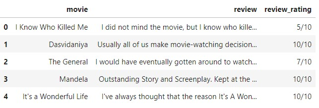

## Problem 1
Following is a sample data containing movie reviews from IMDB. Let's say we want to learn a model which can predict if a review is good, average or bad. To do this, first we need to define what we mean a good, average or bad review. For now, we can consider good as `rating>=8`, average as `6<=rating<=7` and bad as `rating<=5`. So, your task is to take this dataset and add a column named `review_class` having this information. 

Bonus1: Plot the distribution of count of each `review_class`.  
Bonus2: Can you implement it in a manner such that users can pass their own definition of review classes for e.g. if they want to consider average as `5<=rating<=7` in some task and average as `6<=rating<=8` in another. 

### data

[Solution Notebook](problem_review_rating.ipynb)

 

## Problem 2
We use the same review data from review rating problem. Let's say we want to build some ML model on this review data which can predict if a review is good, average or bad. In most ML models, it is required that we set the maximum length of review in terms of words or chars i.e. `max_sentence_length`. This allows the model to process multiple reviews at once in the form of a matrix `(num_reviews, max_sentence_length)`. So, after deciding the `max_sentence_length`, we pad or trim the reviews to make their length consistent. 

In this problem, your task is to analyze what is the average and median number of word in reviews.

Bonus1: Plot the histogram distribution of review length.   
Bonus2: Sometimes average and median are not sufficient and we want to know lengths at other percentiles to make a more informed decision. Thus calculate 90th, 95th and 99th percentile number of word in the reviews.

### data

[Solution Notebook](problem_review_length.ipynb)

