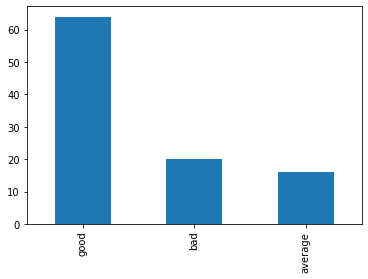

## Setup

### imports


```python
import pandas as pd
import matplotlib.pyplot as plt
```

### load data


```python
df_reviews = pd.read_csv("https://raw.githubusercontent.com/ada0110/practice-problems/main/df_reviews_sample.csv")
df_reviews.head()
```


<div>
<style scoped>
    .dataframe tbody tr th:only-of-type {
        vertical-align: middle;
    }

    .dataframe tbody tr th {
        vertical-align: top;
    }

    .dataframe thead th {
        text-align: right;
    }
</style>
<table border="1" class="dataframe">
  <thead>
    <tr style="text-align: right;">
      <th></th>
      <th>movie</th>
      <th>review_title</th>
      <th>review</th>
      <th>review_rating</th>
    </tr>
  </thead>
  <tbody>
    <tr>
      <th>0</th>
      <td>Braveheart</td>
      <td>Gibson's best as director- melodramatic in bet...</td>
      <td>It was too much to take in upon first trying t...</td>
      <td>9/10</td>
    </tr>
    <tr>
      <th>1</th>
      <td>Left Behind</td>
      <td>This is just the beginning......</td>
      <td>Wow.......Nicolas Cage does his best Elvis as ...</td>
      <td>4/10</td>
    </tr>
    <tr>
      <th>2</th>
      <td>Drishyam</td>
      <td>One of most powerful movies ever</td>
      <td>This is a true tour-de-force that has you grip...</td>
      <td>10/10</td>
    </tr>
    <tr>
      <th>3</th>
      <td>Troll 2</td>
      <td>"There's no coffee here in Nilbog... it's the ...</td>
      <td>Troll 2 starts as Michael (George Hardy) &amp; Dia...</td>
      <td>5/10</td>
    </tr>
    <tr>
      <th>4</th>
      <td>Pad Man</td>
      <td>Problem is good</td>
      <td>After months of waiting for an enchanting movi...</td>
      <td>10/10</td>
    </tr>
  </tbody>
</table>
</div>


## Problem Statement
This is a sample data containing movie reviews from IMDB (we will learn later how to build a dataset like this). Let's say we want to learn a model which can predict if a review is good, average or bad. To do this, first we need to define what we mean a good, average or bad review. For now, we can consider good as `rating>=8`, average as `6<=rating<=7` and bad as `rating<=5`. So, your task is to take this dataset and add a column named `review_class` having this information. 

Bonus1: Plot the distribution of count of each `review_class`.  
Bonus2: Can you implement it in a manner such that users can pass their own definition of review classes for e.g. if they want to consider average as `5<=rating<=7` for 1 some task and average as `6<=rating<=8` for another. 


## Solution


```python
def rating_to_class(rating):
    """converts rating to class. for e.g. 7/10 -> 7 -> good
    """
    rating = int(rating.split("/")[0])
    if rating >= 8:
        return "good"
    elif rating >= 6:
        return "average"
    return "bad"
```


```python
df_reviews["review_class"] = df_reviews.review_rating.apply(lambda x: rating_to_class(x))
df_reviews.head()
```


<div>
<style scoped>
    .dataframe tbody tr th:only-of-type {
        vertical-align: middle;
    }

    .dataframe tbody tr th {
        vertical-align: top;
    }

    .dataframe thead th {
        text-align: right;
    }
</style>
<table border="1" class="dataframe">
  <thead>
    <tr style="text-align: right;">
      <th></th>
      <th>movie</th>
      <th>review_title</th>
      <th>review</th>
      <th>review_rating</th>
      <th>review_class</th>
    </tr>
  </thead>
  <tbody>
    <tr>
      <th>0</th>
      <td>Braveheart</td>
      <td>Gibson's best as director- melodramatic in bet...</td>
      <td>It was too much to take in upon first trying t...</td>
      <td>9/10</td>
      <td>good</td>
    </tr>
    <tr>
      <th>1</th>
      <td>Left Behind</td>
      <td>This is just the beginning......</td>
      <td>Wow.......Nicolas Cage does his best Elvis as ...</td>
      <td>4/10</td>
      <td>bad</td>
    </tr>
    <tr>
      <th>2</th>
      <td>Drishyam</td>
      <td>One of most powerful movies ever</td>
      <td>This is a true tour-de-force that has you grip...</td>
      <td>10/10</td>
      <td>good</td>
    </tr>
    <tr>
      <th>3</th>
      <td>Troll 2</td>
      <td>"There's no coffee here in Nilbog... it's the ...</td>
      <td>Troll 2 starts as Michael (George Hardy) &amp; Dia...</td>
      <td>5/10</td>
      <td>bad</td>
    </tr>
    <tr>
      <th>4</th>
      <td>Pad Man</td>
      <td>Problem is good</td>
      <td>After months of waiting for an enchanting movi...</td>
      <td>10/10</td>
      <td>good</td>
    </tr>
  </tbody>
</table>
</div>


### bonus 1


```python
# we can use conbination of pd.plot(kind="bar") method on pd.value_counts() to plot the distribution of review class
# use kind="barh" for horizontal bars, for other options please check https://pandas.pydata.org/docs/reference/api/pandas.DataFrame.plot.html
# to recall how value_counts() work please check problem (https://www.practiceprobs.com/problemsets/python-pandas/series/baby-names/)
df_reviews.review_class.value_counts().plot(kind="bar")
```


    <matplotlib.axes._subplots.AxesSubplot at 0x232dc021d30>





### bonus 2


```python
# to allow users to define review_class, we can add an argument to rating_to_class() method

def rating_to_class(rating, class_definition):
    """converts rating to class. for e.g. 7/10 -> 7 -> review_class
    """
    rating = int(rating.split("/")[0])
    for review_class, rating_range in class_definition.items():
        if rating in rating_range:
            return review_class


class_definition = {
                    "good": range(8, 11), # we do 11 instead of 10 because range() returns range object from [start, end-1]
                    "average": range(6, 8), 
                    "bad": range(1, 6),
                   }

df_reviews["review_class2"] = df_reviews.review_rating.apply(lambda x: rating_to_class(x, class_definition))
df_reviews.head()
```


<div>
<style scoped>
    .dataframe tbody tr th:only-of-type {
        vertical-align: middle;
    }

    .dataframe tbody tr th {
        vertical-align: top;
    }

    .dataframe thead th {
        text-align: right;
    }
</style>
<table border="1" class="dataframe">
  <thead>
    <tr style="text-align: right;">
      <th></th>
      <th>movie</th>
      <th>review_title</th>
      <th>review</th>
      <th>review_rating</th>
      <th>review_class</th>
      <th>review_class2</th>
    </tr>
  </thead>
  <tbody>
    <tr>
      <th>0</th>
      <td>Braveheart</td>
      <td>Gibson's best as director- melodramatic in bet...</td>
      <td>It was too much to take in upon first trying t...</td>
      <td>9/10</td>
      <td>good</td>
      <td>good</td>
    </tr>
    <tr>
      <th>1</th>
      <td>Left Behind</td>
      <td>This is just the beginning......</td>
      <td>Wow.......Nicolas Cage does his best Elvis as ...</td>
      <td>4/10</td>
      <td>bad</td>
      <td>bad</td>
    </tr>
    <tr>
      <th>2</th>
      <td>Drishyam</td>
      <td>One of most powerful movies ever</td>
      <td>This is a true tour-de-force that has you grip...</td>
      <td>10/10</td>
      <td>good</td>
      <td>good</td>
    </tr>
    <tr>
      <th>3</th>
      <td>Troll 2</td>
      <td>"There's no coffee here in Nilbog... it's the ...</td>
      <td>Troll 2 starts as Michael (George Hardy) &amp; Dia...</td>
      <td>5/10</td>
      <td>bad</td>
      <td>bad</td>
    </tr>
    <tr>
      <th>4</th>
      <td>Pad Man</td>
      <td>Problem is good</td>
      <td>After months of waiting for an enchanting movi...</td>
      <td>10/10</td>
      <td>good</td>
      <td>good</td>
    </tr>
  </tbody>
</table>
</div>


```python
df_reviews.review_class2.value_counts().plot(kind="bar")
```


    <matplotlib.axes._subplots.AxesSubplot at 0x232dbf415f8>


Note: In the above implementation, we left it upto users to make sure that their class_definition is valid i.e. if have a rating in two classes, the first matched review_class will be returned. 
